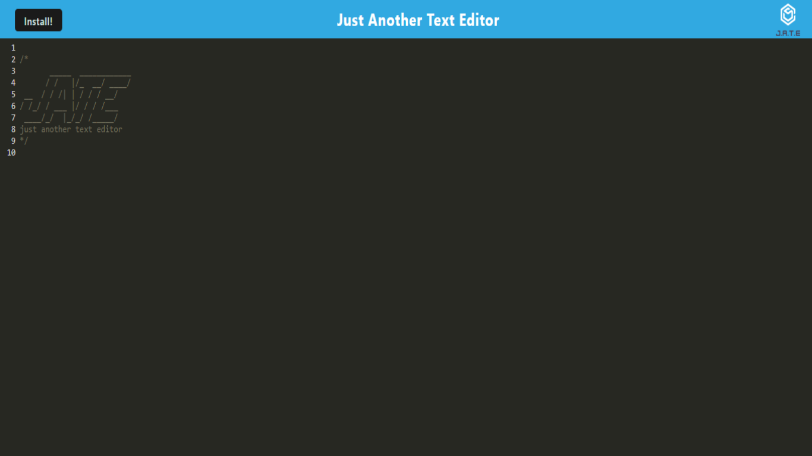

# Text Editor or JATE

This is a text editor to save snippets of text and install the app to one's device to view the snippets offline and edit it either offline or online. This challenge is practice for learning to create a PWA using service workers and IndexedDB.

## Description

In this app, one will be able to install the app as if it were a native app to improve performance and make the page viewable offline. When a note is written in the app, it will be added to a local storage and a database, and a service worker will use a cache to save the webpage so when it is accessed offline it will appear as if it was still online. This application makes use of Webpack, a manifest.json, registered service workers, and IndexedDB - among other tools - to create a text editor that can be installed and edited offline or on.

## Credits

The starter code was provided by the Ohio State University Full-Stack Web Development Bootcamp, found here; [LINK](https://github.com/coding-boot-camp/cautious-meme).

## Description

This is a project that uses Webpack, among other technologies, to create a website to write text and edit it. With it saving when you click off the page, it then can be checked and used offline. This allows users to keep access to a web page even if, say, their internet shuts off or if they're traveling. In offline, it will work the same as online ie. saving when the screen isn't active and the user can edit their notes.

## Preview

## Usage

Use the install button to download the PWA as if it were a native app, following a successfully installation one can create text snippets and access them directly in the app from the downloaded version. This downloaded version can be accessed offline.